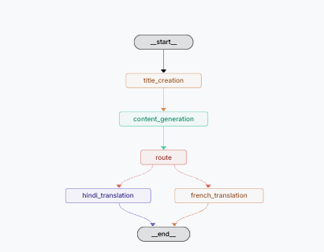
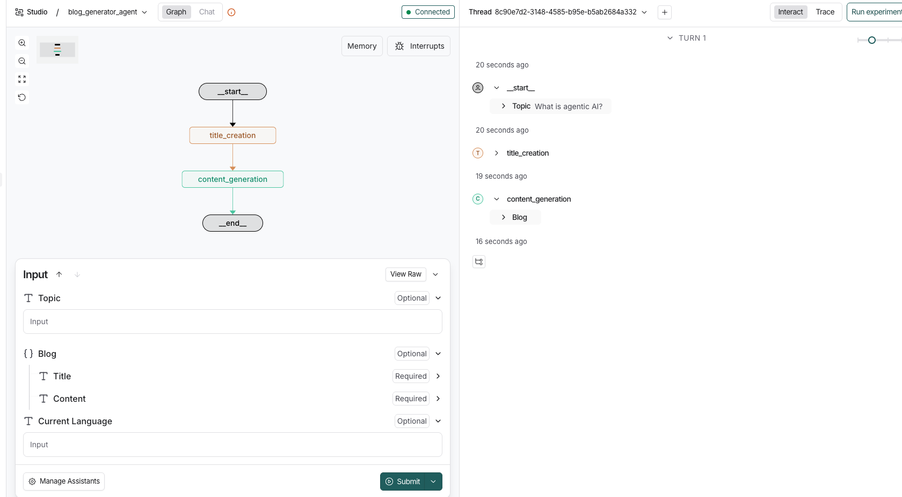

Each node performs a dedicated responsibility, making the system modular, debuggable, and production-ready.

---

## 🧠 Architecture

### Graph Nodes

| Node Name | Responsibility |
|---------|---------------|
| `__start__` | Entry point of the LangGraph workflow |
| `title_creation` | Generates a compelling blog title based on user input |
| `content_generator` | Expands the title into a full blog article |
| `__end__` | Terminates the workflow |

---

## ✨ Features

- ✅ Modular agent design using **LangGraph**
- ✅ Stateful execution with clear node transitions
- ✅ Observability & tracing via **LangSmith**
- ✅ Easy local development using `langgraph dev`
- ✅ Python 3.11 compatible
- ✅ Production-friendly architecture

---

## 🛠️ Tech Stack

- **Python 3.11+**
- **LangGraph**
- **LangChain**
- **LangSmith**
- **OpenAI / LLM provider**
- **uv** (for fast dependency management)

---

## 📦 Project Structure


## Steps to Setup Environment
pip install -U uv

## Clone Repo
git clone https://github.com/kaushikpichumani/BlogGenerationAgent.git
cd BlogGenerationAgent

## Pin python version
uv python pin 3.11

## initialize the uv to initialize the project space
uv init

## Create Venv
uv venv
source .venv/bin/activate

## install dependencies from requirements.txt
uv add -r requirements.txt

## To do test run 

python app.py

## To test we can use postman 

## ▶️ Running the LangGraph Dev Server

This project uses **`uv` for environment and dependency management**.  
As a result, all CLI commands **must be executed within the `uv`-managed virtual environment**.

### ✅ Running in Langserve


uv run langgraph dev


## 🧠 LangGraph Workflow Diagram

The following diagram illustrates the **LangGraph execution flow** used by the Blog Generation Agent.  
It shows how the agent progresses through each node in a structured and deterministic manner.

<p align="center">
  
</p>

### Workflow Overview


## 🧠 Output from LangSmith

The following diagram illustrates the sample output of the orchestration.

<p align="center">
  
</p>


## 🧩 `langgraph.json` Configuration

The `langgraph.json` file defines how LangGraph discovers, loads, and runs graphs in this project. It acts as the **entry-point configuration** for the LangGraph CLI and is required when running the project using the development server.

This file enables LangGraph to:
- Locate graph definitions
- Load project dependencies
- Inject environment variables
- Expose graphs in the LangGraph Dev UI and LangSmith

---

### 📄 `langgraph.json`

```json
{
  "dependencies": ["."],
  "graphs": {
    "blog_generator_agent": "./src/graphs/graph_builder.py:graph"
  },
  "env": "./.env"
}
```json


